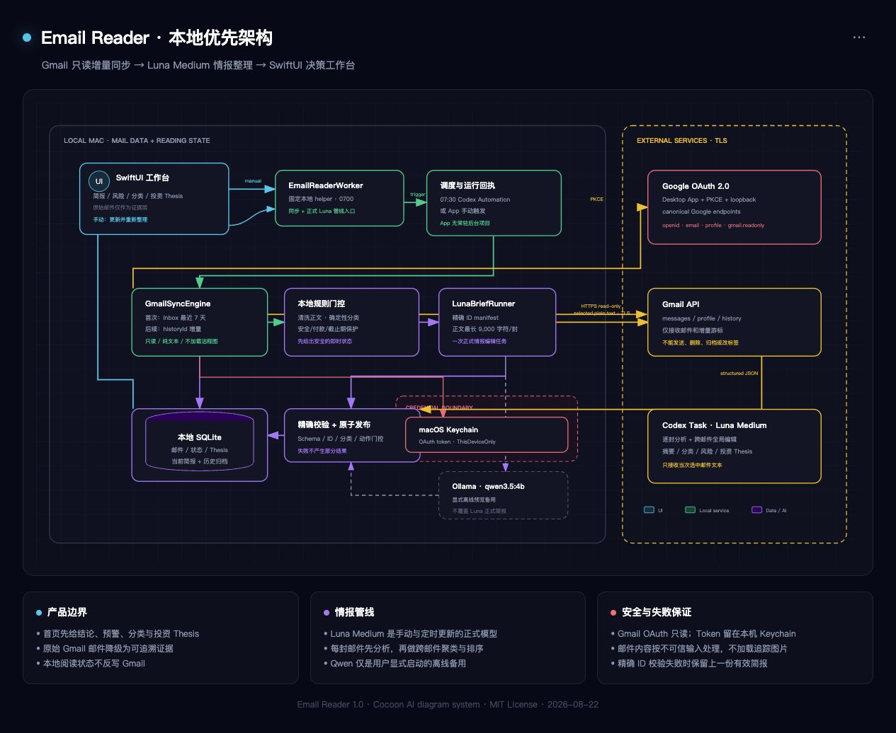
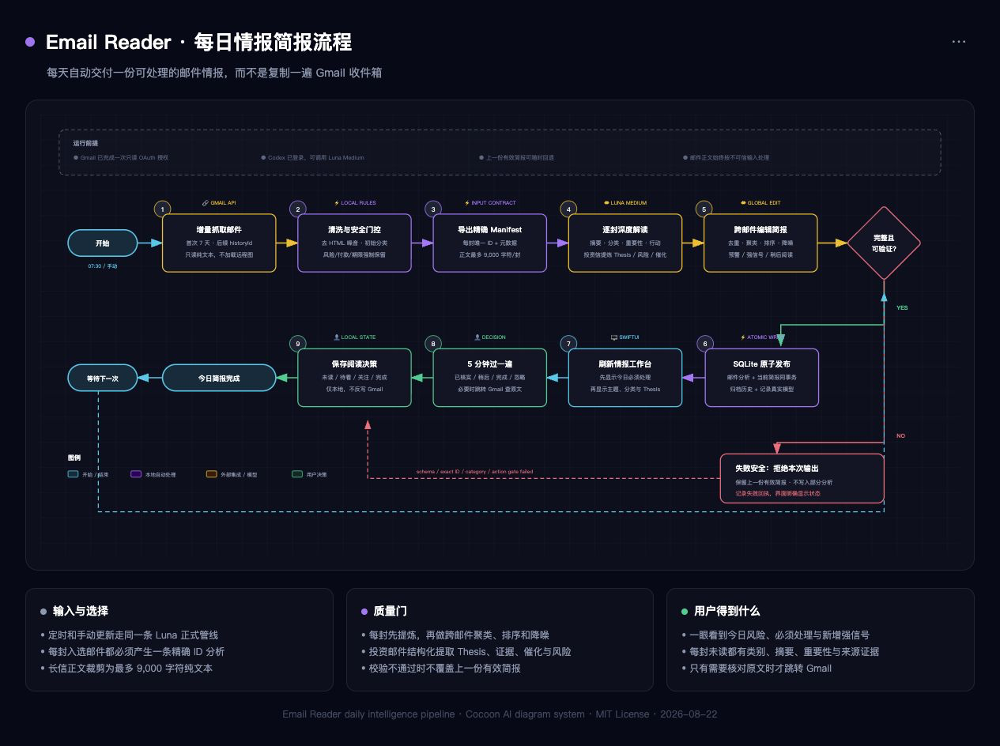

# Email Reader

Email Reader is a local-first macOS email intelligence desk for Gmail. It turns new mail into a daily briefing, risk queue, and focused reading list instead of recreating a Gmail inbox.

## Architecture and daily workflow

The production path is deliberately brief-first: Gmail is a read-only source,
Luna Medium is the formal interpretation engine, and SQLite is the local source
of truth for reading state and published briefings.

### Local-first system architecture

[](Docs/email-reader-architecture.html)

### Daily intelligence pipeline

[](Docs/daily-intelligence-flow.html)

Open the linked standalone HTML files in a browser to inspect the full-size SVG
or export a high-resolution PNG/PDF. See [Architecture](Docs/ARCHITECTURE.md) for
component responsibilities, trust boundaries, and failure behavior. The diagram
system is adapted from [Cocoon AI's MIT-licensed Architecture Diagram
Generator](https://github.com/Cocoon-AI/architecture-diagram-generator).

## Version 1.0

- Brief-first native SwiftUI workspace; the original mailbox is a collapsed evidence library.
- Intelligence-first sidebar with daily alert status, dynamic cross-mail research themes, thesis-weighted ticker focus, readable mail-type counts, and source/history drill-down.
- Local SQLite database; production builds never insert demo email.
- Gmail OAuth Desktop App flow with PKCE and a loopback callback.
- First import is limited to the last 7 days of inbox mail; later runs use Gmail history for incremental changes.
- OAuth tokens stored in macOS Keychain.
- Initial 7-day Gmail import and subsequent `historyId` incremental sync.
- Deterministic rules provide an immediate safe classification after sync; Luna Medium then directly analyzes every selected daily email and publishes the authoritative classification and summary.
- Long mail is summarized in selected sections and consolidated into one fact-focused result. Summary fingerprints avoid reprocessing unchanged bodies.
- Investment Substack mail has a dedicated Luna research pass: core Thesis, supporting evidence, catalysts, disconfirming risks, explicit tickers, and time horizon are stored as structured data instead of flattened into a generic summary.
- Luna Medium produces the globally edited final briefing; the UI records and displays the provider that actually generated the current brief.
- Scheduled and manual refreshes both ask Luna Medium to analyze the daily source text and publish only a validated pipeline result. A failed Luna run preserves the previous final brief instead of silently downgrading the UI.
- System-detected risks and user-followed mail are stored separately, so reanalysis cannot erase a user decision or hide a security alert.
- Every successful briefing is archived locally for daily history review.
- Local unread, read-later, attention, and completed states.
- A Codex automation runs at 07:30. Luna Medium performs the daily analysis without requiring the app to stay open. The app does not register a macOS background item.
- Ollama `qwen3.5:4b` remains available only as an explicitly invoked offline fallback; it is not used by scheduled or manual production refreshes.
- Remote message images are not rendered in version one.

## Build and install

```bash
./scripts/build_app.sh
./scripts/install_personal_app.sh
open "$HOME/Applications/Email Reader.app"
```

The default build is ad-hoc signed for personal installation only. Do not
redistribute that binary. A public binary release must use an Apple Developer
ID Application certificate, Hardened Runtime, and notarization:

```bash
EMAILREADER_SIGNING_IDENTITY="Developer ID Application: Example (TEAMID)" ./scripts/build_app.sh
```

## Connect Gmail

Create a Google Cloud OAuth client of type **Desktop app**, enable the Gmail API, and download the client JSON. In Email Reader, open **账户与更新设置**, choose the JSON, and finish the browser authorization for the Gmail account you want to read.

The app requests only profile identity plus `gmail.readonly`.

## Privacy and security

- The repository contains no mailbox database, OAuth client JSON, refresh token, access token, or generated email artifact.
- OAuth credentials are stored as one macOS Keychain item and updated in place. New items use `AfterFirstUnlockThisDeviceOnly`.
- Keychain-backed Gmail sync runs through a fixed local helper at `~/Library/Application Support/EmailReader/EmailReaderWorker`. Normal App updates do not replace it, so their changing ad-hoc signature does not repeatedly invalidate Keychain access.
- Gmail access is read-only. The app cannot send, delete, archive, label, or mark Gmail messages as read.
- Remote images and tracking pixels are not rendered.
- Email content is treated as untrusted input. Local and optional cloud prompts explicitly reject instructions embedded in mail.
- The daily and manual Luna path sends the selected 24-hour email text to the user's authenticated Codex task so Luna can produce primary-source summaries. The app clips long bodies, treats email as untrusted input, and retains all mailbox data locally outside that analysis request.
- Imported OAuth JSON cannot redirect credentials: only known Google endpoints are accepted and all token refreshes use the compiled-in canonical Google endpoint.
- Luna results are bound to the exact exported mail-ID manifest and are published with the active brief in one SQLite transaction; rejected output cannot partially rewrite per-mail analysis.

## Data locations

- SQLite: `~/Library/Application Support/EmailReader/email_reader.sqlite3`
- OAuth credentials: one bundled macOS Keychain item under service `com.sota.EmailReader.oauth.v4`
- Installed app: `~/Applications/Email Reader.app`
- Codex brief contract: `CODEX_DAILY_BRIEF.md`
- Brief history: `~/Library/Application Support/EmailReader/brief_history/`
- Stable Gmail sync helper: `~/Library/Application Support/EmailReader/EmailReaderWorker`

Generated build products and analysis artifacts are intentionally excluded from Git. Run `./scripts/verify.sh` to recreate and validate them.

## License

Released under the [MIT License](LICENSE).
